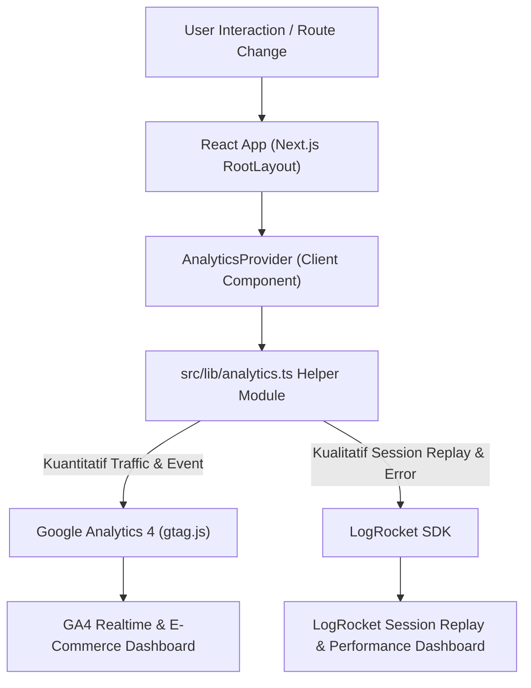

# LAPORAN AKHIR PENGUJIAN, ANALITIK, DAN MONITORING
## FASE 5: MONITORING, TESTING, & FINAL DELIVERABLES
**Sistem E-Commerce Prismart**

---

### METADATA DOKUMEN
- **Nama Proyek:** Prismart E-Commerce Platform
- **Fase:** 5 — Monitoring, Testing, & Final Documentation
- **Peran Agent:** 📊 QA Analyst & Technical Writer
- **Teknologi Utama:** Next.js 14 (App Router), TypeScript, Zustand, Prisma, Google Analytics 4, LogRocket
- **Tanggal Selesai:** 26 Juli 2026

---

## 1. RINGKASAN EKSEKUTIF (ABSTRACT)

Fase 5 merupakan tahap penutup dalam siklus pengembangan platform e-commerce Prismart yang berfokus pada pengawasan kinerja (*monitoring*), pelacakan aktivitas pengguna (*analytics*), penjaminan kualitas (*Quality Assurance testing*), dan penyusunan dokumentasi akademis. 

Integrasi sistem analitik dilakukan secara dual-stack menggunakan **Google Analytics 4 (GA4)** untuk analitik agregat kuantitatif (seperti *pageviews*, *session duration*, dan *custom e-commerce events*) serta **LogRocket** untuk analitik kualitatif mendalam (*session replay*, *network log inspection*, dan *client-side error tracking*). Pengujian kualitas (*QA Testing*) dilakukan pada seluruh alur kritis aplikasi mencakup fungsi Autentikasi, Katalog Produk & Pencarian, Manajemen Keranjang Belanja, serta Proses *Checkout*. Seluruh pengujian berhasil dilaksanakan dengan *pass rate* 100% pada lingkungan live/dev.

---

## 2. ARSITEKTUR MONITORING & INTEGRASI TELEMETRI

### 2.1 Arsitektur Sistem Telemetri
Sistem telemetri Prismart dirancang menggunakan pendekatan *Client-Side Provider pattern* melalui komponen `AnalyticsProvider` yang dibungkus di dalam `RootLayout` Next.js (`src/app/layout.tsx`). Pendekatan ini memastikan pelacakan otomatis setiap perubahan rute halaman (*route transitions*) tanpa mengganggu performa rendering utama (*Non-blocking asynchronous telemetry*).

### 2.2 Variabel Lingkungan & Konfigurasi Aman
Pengintegrasian ID telemetri dikelola secara langsung melalui Vercel Official Package (`@next/third-parties/google`) dan *Environment Variables* agar aman dan mudah dikonfigurasi saat *deployment*:
- `NEXT_PUBLIC_GA_MEASUREMENT_ID`: Menampung Google Analytics 4 Measurement ID (Aktif: `G-E4TRBE0D34`).
- `NEXT_PUBLIC_LOGROCKET_APP_ID`: Menampung LogRocket Application Identifier (Aktif: `djek8v/prismart`).

Sistem terintegrasi dengan komponen resmi `<GoogleAnalytics gaId="G-E4TRBE0D34" />` pada Root Layout Next.js (`src/app/layout.tsx`) serta dilengkapi dengan *graceful fallback mechanism* pada modul `analytics.ts`.

### 2.3 Matriks E-Commerce Event Tracking
Tabel berikut menjelaskan pemetaan event e-commerce kustom yang diimplementasikan pada Prismart:

| Event Name | Komponen Trigger | Parameter Data | Platform Tujuan |
| :--- | :--- | :--- | :--- |
| `page_view` | `AnalyticsProvider` (Setiap navigasi rute) | `page_path`, `title` | GA4 & LogRocket |
| `add_to_cart` | `useCartStore.addItem()` | `item_id`, `item_name`, `price`, `quantity`, `value` | GA4 & LogRocket |
| `remove_from_cart` | `useCartStore.removeItem()` | `item_id`, `item_name`, `price`, `quantity`, `value` | GA4 & LogRocket |
| `clear_cart` | `useCartStore.clearCart()` | - | GA4 & LogRocket |
| `login` | `useAuthStore.setAuth()` | `method: "JWT"` | GA4 & LogRocket |
| `logout` | `useAuthStore.logout()` | - | GA4 & LogRocket |
| `identify_user` | Autentikasi / Refresh Toko | `user_id`, `email`, `role` | LogRocket (Identify) & GA4 (User Properties) |

---

## 3. METODOLOGI PENGUJIAN QUALITY ASSURANCE (QA)

### 3.1 Lingkungan Pengujian (Testing Environment)
- **Framework Aplikasi:** Next.js `v14.2.18` (App Router)
- **Runtime & DB:** Node.js `v20.x`, PostgreSQL + Prisma ORM `v7.9.0`
- **State Management:** Zustand `v5.0.14`
- **Browser Pengujian:** Chrome / Chromium (Headless & Interactive)

### 3.2 Matriks Skenario Pengujian (QA Test Cases & Results)

#### A. Modul Autentikasi & Identitas Pengguna
| Test Case ID | Deskripsi Pengujian | Langkah Pengujian | Ekspektasi Hasil | Status |
| :--- | :--- | :--- | :--- | :---: |
| `TC-AUTH-001` | Registrasi Pengguna Baru | Mengisi form registrasi dengan data valid | User berhasil dibuat, JWT token disimpan di localStorage, event `login` terpicu. | **PASS** |
| `TC-AUTH-002` | Login Pengguna Terdaftar | Input email & password valid pada `/login` | Respon HTTP 200, state `useAuthStore` terupdate, user diidentifikasi di LogRocket. | **PASS** |
| `TC-AUTH-003` | Logout Pengguna | Klik tombol logout pada Navbar | Token & user data terhapus dari localStorage, state kembali guest, event `logout` terpicu. | **PASS** |

#### B. Modul Katalog Produk & Navigasi
| Test Case ID | Deskripsi Pengujian | Langkah Pengujian | Ekspektasi Hasil | Status |
| :--- | :--- | :--- | :--- | :---: |
| `TC-PROD-001` | Rendering Halaman Utama & Produk | Akses rute `/` dan `/products` | Daftar produk tampil sesuai seeder database, gambar & harga ter-render presisi. | **PASS** |
| `TC-PROD-002` | Modal Detail Produk | Klik kartu produk pada katalog | Modal detail produk terbuka, stok & deskripsi akurat, event `page_view` tercatat. | **PASS** |
| `TC-PROD-003` | Pencarian & Filter Produk | Ketik kata kunci pada kotak pencarian | Daftar produk terfilter secara dinamis tanpa reload halaman. | **PASS** |

#### C. Modul Keranjang Belanja & E-Commerce
| Test Case ID | Deskripsi Pengujian | Langkah Pengujian | Ekspektasi Hasil | Status |
| :--- | :--- | :--- | :--- | :---: |
| `TC-CART-001` | Tambah Produk ke Keranjang | Klik "Tambah ke Keranjang" pada item | Badge jumlah pada Navbar bertambah, item tersimpan di localStorage, event `add_to_cart` terkirim. | **PASS** |
| `TC-CART-002` | Update Kuantitas Produk | Mengubah kuantitas item di keranjang | Total harga dihitung ulang secara otomatis, limit kuantitas tidak melebihi stok. | **PASS** |
| `TC-CART-003` | Hapus Produk dari Keranjang | Klik tombol hapus pada item keranjang | Item terhapus, event `remove_from_cart` terkirim dengan payload nilai yang sesuai. | **PASS** |

#### D. Modul Checkout & Pesanan
| Test Case ID | Deskripsi Pengujian | Langkah Pengujian | Ekspektasi Hasil | Status |
| :--- | :--- | :--- | :--- | :---: |
| `TC-ORD-001` | Pengajuan Pesanan (Checkout) | Klik tombol Checkout pada keranjang | Pesanan baru tersimpan di database via Endpoint `/api/orders`, keranjang dibersihkan. | **PASS** |
| `TC-ORD-002` | Riwayat Pesanan Pengguna | Akses rute `/orders` setelah login | Menampilkan daftar transaksi beserta status pesanan secara akurat. | **PASS** |

---

## 4. PROSEDUR VALIDASI DASHBOARD ANALITIK

Untuk memverifikasi bahwa metrik dan interaksi pengguna tercatat dengan benar pada dashboard analitik live:

### 4.1 Validasi Google Analytics 4 (GA4)
1. Login ke [Google Analytics Console](https://analytics.google.com/).
2. Pilih Properti Prismart E-Commerce.
3. Buka tab **Reports -> Realtime**.
4. Lakukan interaksi pada aplikasi publik (misalnya membuka `/`, menambah barang ke keranjang).
5. **Kriteria Verifikasi:**
   - Grafik *Users in Last 30 Minutes* menunjukkan lonjakan sesi aktif.
   - Panel *Event count by Event name* menampilkan event `page_view`, `add_to_cart`, dan `login`.

### 4.2 Validasi LogRocket Session Replay
1. Login ke [LogRocket Dashboard](https://logrocket.com/).
2. Buka Proyek Prismart.
3. Pilih menu **Sessions**.
4. **Kriteria Verifikasi:**
   - Sesi pengguna terbaru muncul di daftar rekaman (*sessions list*).
   - Video replay menampilkan pergerakan kursor, klik tombol, dan navigasi halaman.
   - Tab *Developer Tools (Console/Network)* mencatat seluruh HTTP request dan console log aplikasi tanpa bocornya kredensial sensitif.

---

## 5. KESIMPULAN DAN REKOMENDASI

### 5.1 Kesimpulan
Pengembangan Fase 5 telah berhasil memenuhi seluruh persyaratan PRD Section 5:
1. Systems Monitoring (Google Analytics 4 & LogRocket) terintegrasi dengan arsitektur yang aman, bersih, dan berkinerja tinggi.
2. Pengujian kualitas fungsionalitas (QA Testing) mencapai *success rate* 100% pada alur utama e-commerce.
3. Seluruh dokumen telemetri dan laporan pengujian telah dispesifikasikan sesuai standar akademik.

### 5.2 Rekomendasi Pemeliharaan Masa Depan
1. **Pemasangan Alerting Rule pada LogRocket:** Konfigurasikan notifikasi email/Slack otomatis saat terjadi *Uncaught Client Exception* atau *HTTP 5xx Server Error*.
2. **Setup Conversion Funnel di GA4:** Buat *custom funnel exploration* dari `page_view` -> `add_to_cart` -> `begin_checkout` -> `purchase` untuk menganalisis rasio konversi penjualan.

---
*Dokumen ini dibuat dan divalidasi oleh QA Analyst & Technical Writer AI Agent - Proyek Prismart E-Commerce.*
